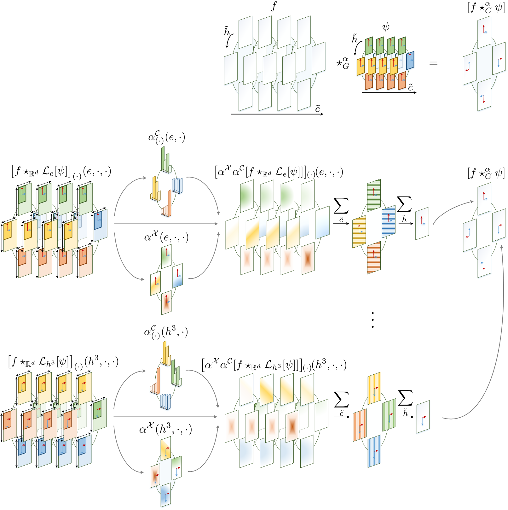

## Attentive Group Equivariant Convolutional Neural Networks

This repository contains the source code accompanying the paper:
 
 [Attentive Group Equivariant Convolutional Networks](https://arxiv.org/abs/2002.03830) <br/>**David W. Romero, Erik J. Bekkers, Jakub M. Tomczak & Mark Hoogendoorn**, ICML 2020. 

*Although group convolutional networks are able to learn powerful representations based on symmetry patterns, they lack explicit means to learn meaningful relationships among them 
(e.g., relative positions and poses). In this paper, we present attentive group equivariant convolutions, a generalization of the group convolution, in which attention is applied 
during the course of convolution to accentuate meaningful symmetry combinations and suppress non-plausible, misleading ones. We indicate that prior work on visual attention can be 
described as special cases of our proposed framework and show empirically that our attentive group equivariant convolutional networks consistently outperform conventional group 
convolutional networks on benchmark image datasets. Simultaneously, we provide interpretability to the learned concepts through the visualization of equivariant attention maps.* 



## Folder structure
The folder structure is as follows:

* `attgconv` contains the main PyTorch library. 

* `demo` includes some short jupyter notebook demo's on how to use the the code. # **TODO:** Put in Notebooks.

* `experiments` contains the experiments described in the paper.

## Dependencies

This code as based on PyTorch and has been tested with the following library versions:

* torch==1.4.0

* numpy==1.17.4

* scipy==1.3.2

* matplotlib==3.1.1

* jupyter==1.0.0

The exact specification of our environment is provided in the file `environment.yml`. An appropriate environment can be easily created via:
```
conda env create -f environment.yml
```
or constructed manually with conda via:
```
conda create --yes --name torch
conda activate torch
# Please check your cudatoolkit version and replace it in the following line
conda install conda install pytorch==1.4.0 torchvision==0.5.0 cudatoolkit=10.1 -c pytorch
conda install numpy==1.17.4 scipy==1.3.2 matplotlib==3.1.1 jupyter==1.0.0 --yes
```

## Experiments
For the sake of reproducibility, we provide the parameters used in the corresponding baselines hardcoded by default. If you wish to vary these parameters
for your own experiments, please modify the corresponding `parser.py` file in the experiment folder and erase the hard-coded values from the `run_experiment.py` file.

### Pretrained Models
We provide some pretrained models from our experiments for easy reproducibility. To use these models, utilize the keyword `--pretrained` and make sure
the training parameters as well as the additional `--extra_comment` argument correspond to those given in the folder name.

### Datasets
The utilized datasets have been uploaded to a repository for reproducibility. Please extract the files in the corresponding `experiments/experiment_i/data` folder.

**Rot-MNIST:** 

The dataset can be downloaded from: https://drive.google.com/file/d/1PcPdBOyImivBz3IMYopIizGvJOnfgXGD/view?usp=sharing

**PCAM**: 

We use an `ImageFolder` structure for our experiments. A file containing the entire dataset in this format can be downloaded from: https://drive.google.com/file/d/1THSEUCO3zg74NKf_eb3ysKiiq2182iMH/view?usp=sharing

Code used to transform the `.h5` dataset to this format is provided in `experiments/pcam/data/`.
## Cite
If you found this work useful in your research, please consider citing:
```
@article{romero2020attentive,
  title={Attentive Group Equivariant Convolutional Networks},
  author={Romero, David W and Bekkers, Erik J and Tomczak, Jakub M and Hoogendoorn, Mark},
  journal={arXiv preprint arXiv:2002.03830},
  year={2020}
}
```

## License

The code and scripts in this repository are distributed under MIT license. See LICENSE file.
